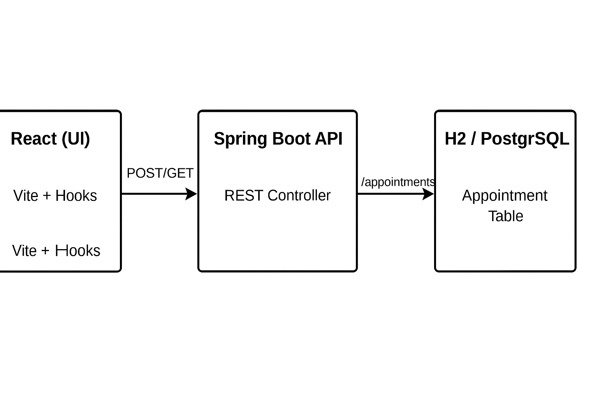

# 🐾 Fullstack Appointment Booking App

A fullstack demo project for booking pet appointments, built with **React + Spring Boot**, using **H2** or **PostgreSQL** as backend storage.

Pending item: Will Deployed at 👉 [https://your-app.onrender.com](https://your-app.onrender.com)

---

## 🛠 Tech Stack

- **Frontend:** React (Vite) + Hooks
- **Backend:** Spring Boot 3 + Java 17
- **Database:** H2 (in-memory) or PostgreSQL (cloud)
- **Deployment:** Render (Free Tier)
- **Build Tool:** Gradle
- **API Pattern:** RESTful

---

## 🚀 Features

- Book pet appointments (name, date, time, reason)
- View appointment history
- Backend API with validation & persistence
- React state management + auto update
- Single-jar deployment (Spring Boot serves React)

## 🌐 API Endpoints
- Method&nbsp;&nbsp;URL&nbsp;&nbsp;&nbsp;&nbsp;&nbsp;&nbsp;&nbsp;&nbsp;&nbsp;&nbsp;&nbsp;&nbsp;&nbsp;&nbsp;&nbsp;&nbsp;&nbsp;&nbsp;&nbsp;Description
- GET&nbsp;&nbsp;&nbsp;&nbsp;&nbsp;&nbsp;&nbsp;&nbsp;/appointments&nbsp;&nbsp;List all appointments
- POST&nbsp;&nbsp;&nbsp;&nbsp;&nbsp;&nbsp;/appointments&nbsp;&nbsp;Create new appointment

---
## 🧠 System Architecture

Frontend and backend are served from the same Spring Boot service.



---
## 🌐 Deployment Notes

- The React frontend is built and copied into src/main/resources/static
- Spring Boot serves frontend + backend on port 8080
- Cloud DB (Render/Railway PostgreSQL) supported via env variables

---

## 📷 Preview


---

## 🔧 Running Locally

```bash
git clone https://github.com/your-name/appointment-app.git
cd appointment-app
./gradlew bootRun

or can run jar file directly, and open url: http://localhost:8080
